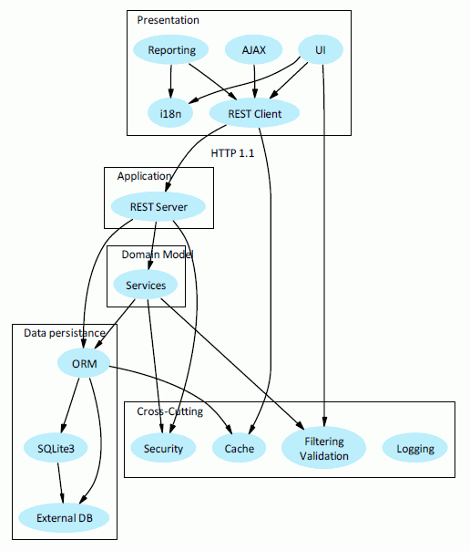

# The CHAOS library

A PHP library that supports building fully featured domain-driven applications.


## Install

``` bash
$ composer require chaos/common
```

## Contributing

Please see [CONTRIBUTING](https://github.com/ntd1712/common/blob/master/CONTRIBUTING.md) and [CONDUCT](https://github.com/ntd1712/common/blob/master/CONDUCT.md) for details.

## Credits

- [ntd1712](https://github.com/ntd1712)

## License

The MIT License (MIT). Please see [License File](https://github.com/ntd1712/common/blob/master/LICENSE) for more information.
